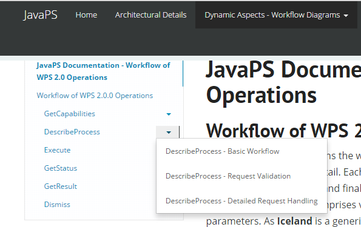
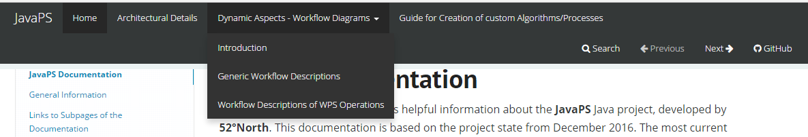

<!-- START doctoc generated TOC please keep comment here to allow auto update -->
<!-- DON'T EDIT THIS SECTION, INSTEAD RE-RUN doctoc TO UPDATE -->
**Table of Contents**  *generated with [DocToc](https://github.com/thlorenz/doctoc)*

- [About using MkDocs](#about-using-mkdocs)
  - [Layout/Structure of gh-pages branch](#layoutstructure-of-gh-pages-branch)
  - [Installation and other Prerequisites](#installation-and-other-prerequisites)
  - [Manual adaption of the cinder theme](#manual-adaption-of-the-cinder-theme)
    - [Customization of TOC - toc.html](#customization-of-toc---tochtml)
    - [Customization of Header display - base.css](#customization-of-header-display---basecss)
  - [Building HTML files from Markdown resources](#building-html-files-from-markdown-resources)
    - [The MkDocs Configuration File](#the-mkdocs-configuration-file)
    - [Relevant MkDocs commands](#relevant-mkdocs-commands)

<!-- END doctoc generated TOC please keep comment here to allow auto update -->

About using MkDocs
==================

The command line tool [MkDocs](http://www.mkdocs.org/) allows quick and automated generation of static HTML-pages from the documentation Markdown resource files. It is published under BSD license.

The general idea is that any changes to the documentation can be performed in the original Markdown resources. Afterwards the tool **MkDocs** can be used to update the HTML contents!

Layout/Structure of gh-pages branch
-----------------------------------

The layout of **JavaPS** gh-pages branch is as follows:

<pre>
<i>javaps (gh-pages branch)</i>
        |
        | - <b>"index.html"</b>
        | - <b>About_MkDocs.md</b>
        | - <i>documentation_markdown</i>
             |
             | - <b>mkdocs.yml</b>
             | - <i>cinder</i>
                  |
                  | - ... // theme related source files for mkdocs theme "cinder"
             | - <i>docs</i>
                  |
                  | - ... // markdown documentation source files
             | - <i>site</i>
                  |
                  | - ... // resulting HTML files created by tool "mkDocs"

</pre>

On first level, the *documentation_markdown* folder comprises all required source files including the Markdown documentation files (in subfolder *docs*), the *mkdocs configuration file* (**mkdocs.yml**), the theme source files for theme [cinder](https://github.com/chrissimpkins/cinder) and finally the generated *HTML files* in subfolder *side*. The first-level **index.html** does not contain any project relevant information. Instead, it simply redirects to the actual **index.html** file, which is located in folder *documentation_markdown\site*.

Installation and other Prerequisites
------------------------------------

As prerequisite to generate ready-to-use HTML files from the Markdown resources, the tool **MkDocs** has to be installed. According to the [installation guide of MkDocs](http://www.mkdocs.org/#installation), it is recommended to install it via the *Python package manager pip*. Through installation of a recent Python version, *pip* should be installed as well. For a manual installation of *pip* use command `python get-pip.py`. To install **MkDocs** via *pip* use command `pip install mkdocs`.

In addition, an **MkDocs** *configuration file* has to be placed inside the directory, from where the [relevant MkDocs command](#relevant-mkdocs-commands) that are explained later should be executed. The contents of this *configuration file* are explained in section [The MkDocs Configuration File](#the-mkdocs-configuration-file).

**MkDocs** provides the ability to apply different themes altering the visual representation of the content. Within the scope of **JavaPS**, the theme [cinder](https://github.com/chrissimpkins/cinder) has been used. While in theory, a theme can simply be installed via *pip* as well, i.e. using the command `pip install mkdocs-cinder` and then added to the configuration file (entry `theme: cinder`), it can also be locally installed inside the *documentation_markdown* folder. As shown above, the folder *documentation_markdown/cinder* comprises the theme's source files (HTML templates, CSS and JS files, fonts, etc.) that were downloaded from [here](http://sourcefoundry.org/cinder/#2-manual-install). A local theme directory can be referenced within the *configuration file* using the entry `theme_dir: cinder`. This way customization of the theme can be applied directly to the theme's source files.

Manual adaption of the cinder theme
-----------------------------------

As mentioned above, the theme [cinder](https://github.com/chrissimpkins/cinder) has been locally included within the *documentation_markdown/cinder* folder. This allows easy customization of its source files. While the theme provides great visuals right away, two files have been customized as follows:

### Customization of TOC - toc.html

File Location: *documentation_markdown/cinder/toc.html*

Per default, **MkDocs** themes support three tiers of headings within an affixed left-sided table of contents (TOC). However, as some documentation pages within **JavaPS** make use of six header tiers, the corresponding template file that generates the TOC has been customized. In the following the whole content of the file is listed including the customization that is tagged by `<!-- CUSTOMIZATION BEGIN -->` and <!-- CUSTOMIZATION END -->`<!-- CUSTOMIZATION END -->`

```
<div class="bs-sidebar hidden-print affix well" role="complementary">
    <ul class="nav bs-sidenav">
    
        <li class="first-level active"><a href="{{ toc_item.url }}">{{ toc_item.title }}</a></li>
        
            <li class="second-level"><a href="{{ toc_item.url }}">{{ toc_item.title }}</a></li>
                     
                <li class="third-level">

                  <!-- CUSTOMIZATION BEGIN -->

                  
                    <a href="{{ toc_item.url }}">{{ toc_item.title }}</a>
                  

                  
                    <div class="row">
                      <div class="col-md-10">
                        <a href="{{ toc_item.url }}">{{ toc_item.title }}</a>
                      </div>
                      <div class="dropdown col-md-2">
                        <a class="dropdown-toggle" data-toggle="dropdown" href="#"><span class="caret"></span></a>
                        <ul class="dropdown-menu">
                          
                            <li class="fourth-level"><a href="{{ toc_item.url }}">{{ toc_item.title }}</a></li>
                           
                        </ul>
                      </div>  
                    </div>
                  

                  <!-- CUSTOMIZATION END -->

                </li>    
            
        
    
    </ul>
</div>
```

Basically, prior to customization the TOC displayed the names of Markdown headers from tiers 1 - 3 including the references as anchors. The intention of the customization was to allow the display of deeper headings (at least tier 4) as well. As restriction, the TOC is configured as [Bootstrap Affix](https://www.w3schools.com/bootstrap/bootstrap_affix.asp) and hence must not grow too large in vertical direction, otherwise TOC contents may be out of display.

For this reason, the customization allows those tier-3-header items that contain deeper-tiered headings to be displayed as two-columned dropdown entry, as shown in the screenshot.

*Customized TOC*

Within the customized tier-3 TOC item, the left-columned section name is an anchor referencing the associated section of he documentation. The right-columned caret symbol represents a dropdown menu containing references to the associated tier-4 subsections. This way, at least one more tier of headers is navigable via TOC.

### Customization of Header display - base.css

File Location: *documentation_markdown/cinder/css/base.css*

The upper customization of TOC items enforces a corresponding manipulation of certain CSS properties within *base.css*. To be precise the styling of the customized tier-3 and tier-4 TOC items has to be aligned. Hence, the following lines have been added to *base.css*, indenting the items and adjusting the colourization:

```
/* CUSTOM ADDITION FOR DIV CONTAINER */
.bs-sidebar .nav > li > div {
    display: block;
    padding: 5px 20px;
    z-index: 1;
}
.bs-sidebar .nav > li > div > div:hover,
.bs-sidebar .nav > li > div > div:focus {
    text-decoration: none;
    border-right: 1px solid;
    background-color: #eee;
}
.bs-sidebar .nav > .active > div,
.bs-sidebar .nav > .active:hover > div,
.bs-sidebar .nav > .active:focus > div {
    font-weight: bold;
    background-color: transparent;
    border-right: 1px solid;
}
```

In addition, the display of the HTML header level 1-6 has been manually adapted, as follows:

```
/* CUSTOM EDITS FOR HEADERS */

h1 {
  font-weight: bold;
}

h2 {
  font-weight: bold;
}

h3 {
  font-weight: bold;
}

h4 {
  font-weight: bold !important;
  font-style: italic !important;
}

h5 {
  font-style: italic !important;
  font-size: 21px !important;
  text-decoration: underline !important;
}

h6 {
  font-style: italic !important;
  font-size: 19px !important;
  text-decoration: underline !important;
}
```

Without those edits, some headers were too small and/or hard to distinguish from normal text.

Building HTML files from Markdown resources
-------------------------------------------

### The MkDocs Configuration File

Inside *documentation_markdown*, the **mkdocs.yml** file controls the building process according to the [MkDocs configuration guide](http://www.mkdocs.org/user-guide/configuration/). It has to be located in the target directory, from where the building process should be executed. Its content is displayed below:

```
site_name: JavaPS

pages:
    - Home: index.markdown
    - Architectural Details: architecture/architecture.markdown
    - Dynamic Aspects - Workflow Diagrams:
        - Introduction: sequence_diagrams/sequence_diagrams.markdown
        - Generic Workflow Descriptions: sequence_diagrams/workflow_general/general_workflow.markdown
        - Workflow Descriptions of WPS Operations: sequence_diagrams/workflow_wps_operations/workflow_wps_operations.markdown
    - Guide for Creation of custom Algorithms/Processes: algorithm_definition/algorithm_definition.markdown
theme_dir: cinder
repo_url: https://github.com/52North/javaPS
```

Via `site_name: JavaPS` the displayed name of the generated HTML output is set. The `pages:` section comprises a list of nested Markdown source files that will be transformed into HTML equivalents. Note that each and every Markdown source file has to be included here and properly nested. Via nesting, thematically related Markdown source files can be grouped together. Each first level entry is available as global entry within a navigation bar located at the top of the generated HTML pages, as displayed below.

*Navigation Bar - note how the navigation bar entries correspond to the structure specified in pages-section of config file*

The entry `theme_dir:` of the configuration file sets the local *cinder* folder as source for the utilized theme. Finally the `repo_url` contains a reference to the GitHub repository of **JavaPS**.

### Relevant MkDocs commands

After [installing](#installation-and-other-prerequisites) and [configuring](#the-mkdocs-configuration-file) **MkDocs** the following basic command are relevant. Note that each command has to be executed via command line from the same folder the configuration file **mkdocs.yml** is located.

-	`mkdocs serve`: This fires up a local test server with a temporary local build of the resulting HTML pages for test purposes. Whenever a change to the Markdown source files or theme source files is applied, the changes can be inspected locally. The test server is deployed at `http://127.0.0.1:8000`.
-	`mkdocs build`: This command builds the HTML output from the configured Markdown resources according to the configuration file. It stores the build in the folder **site**.
